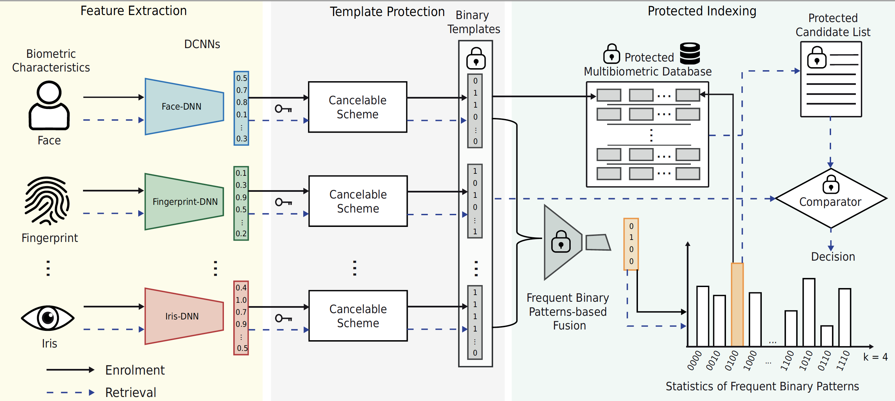
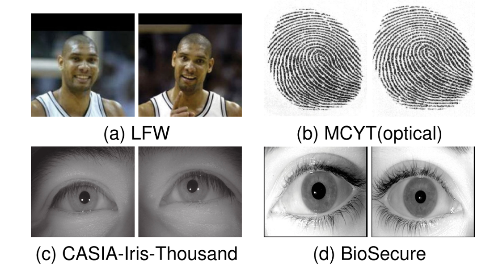
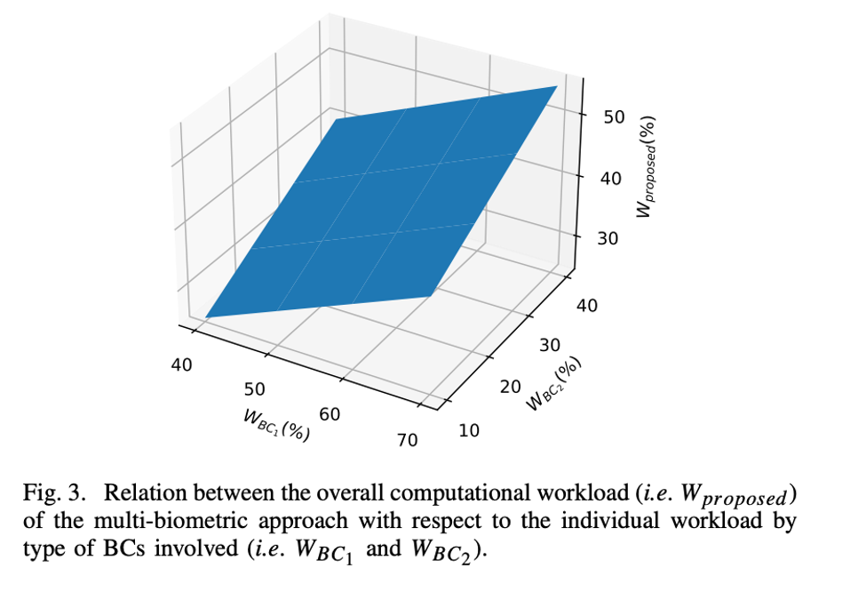
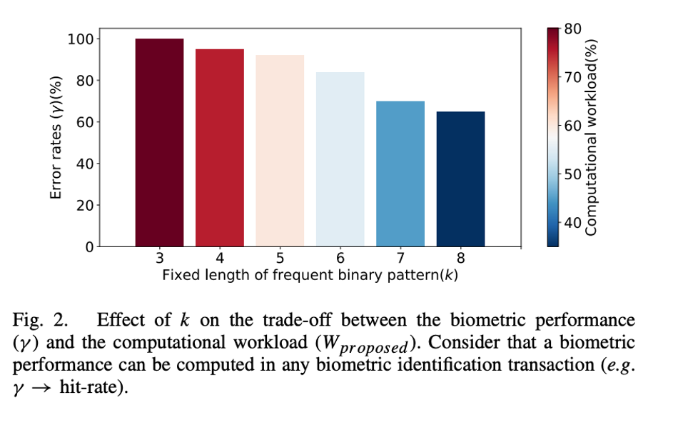
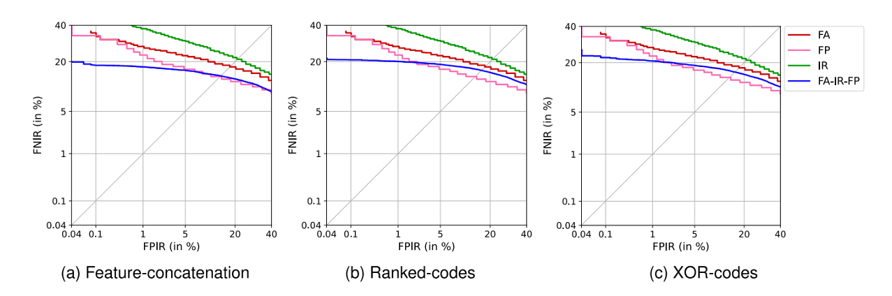

# Frequent Binary Patterns for Indexing Multi-biometric Deep Templates Protected by Cancelable Biometrics
Refactored code used in the paper "Privacy-Preserving Multi-Biometric Indexing Based on Frequent Binary Patterns" (TIFS 2024, Osorio-Roig et al. (https://ieeexplore.ieee.org/abstract/document/10494735)).

# Abstract
The development of large-scale identification systems that ensure the privacy protection of enrolled subjects represents a major challenge. Biometric deployments that provide interoperability and usability by including efficient multi-biometric solutions are a recent requirement. In the context of privacy protection, several template protection schemes have been proposed in the past. However, these schemes seem inadequate for indexing (workload reduction) in biometric identification systems. More specifically, they have been used in identification systems that perform exhaustive searches, leading to a degradation of computational efficiency. To overcome these limitations, we propose an efficient privacy-preserving multi-biometric identification system that retrieves protected deep cancelable templates and is agnostic with respect to biometric characteristics and biometric template protection schemes. To this end, a multi-biometric binning scheme is designed to exploit the low intra-class variation properties contained in the frequent binary patterns extracted from different types of biometric characteristics. Experimental results reported on publicly available databases using state-of-the-art Deep Neural Network (DNN)-based embedding extractors show that the protected multi-biometric identification system can reduce the computational workload to approximately 57% (indexing up to three types of biometric characteristics) and 53% (indexing up to two types of biometric characteristics), while simultaneously improving the biometric performance of the baseline biometric system at the high-security thresholds. The source code of the proposed multi-biometric indexing approach together with the composed multi-biometric dataset, will be made available to the research community once the article is accepted.

# Citation

```{bibtex}

@article{OsorioRoig-FBPMultiBiometricIndexing-TIFS-2023,
 Author = {D. Osorio-Roig and LJ. Gonzalez-Soler and C. Rathgeb and C. Busch},
 Groups = {TReSPAsS-ETN, ATHENE, NGBS},
 Journal = {Trans. on Information Forensics \& Security ({TIFS})},
 Keywords = {Face Recognition, Workload Reduction, Indexing, Data Privacy},
 Month = {April},
 Pages = {4835-4850},
 Title = {Privacy-preserving Multi-biometric Indexing based on Frequent Binary Patterns},
 Volume = {19},
 Year = {2024}
 doi={10.1109/TIFS.2024.3386310}

}

```

# Contributions

An efficient privacy-preserving multi-biometric system that is agnostic across cancelable biometric template protection schemes (with binary representation) and biometric characteristics. This solution is able to operate on the most secure processing step (i.e. feature level) in a biometric system by enabling fusion strategies on the concept of frequent binary patterns at two steps: the representation- and feature-based step. The fusion in the representation-step retrieval and indexing shows that the workload reduction and the biometric performance are irrespective of the ranking (i.e. order of priority) of the biometric characteristics, in contrast to the fusion in the feature-step retrieval and indexing. 

# Conceptual overview of the proposed multi-biometric scheme



# Installation

1- Download the databases to use. For this contribution, we used the following databases:



2- Extract embeddings from DNNs from different m types of biometric characteristics and protect them using Cancelable Biometrics where outputs are binary representations. Keep the cancelable biometrics in stolen scenario!

3- pip install numpy

4- pip install pyeer --> getting evaluation on DET curves.

4- Use and apply a method of score normalization according to the database utilised before applying the fusion technique in this code.


Project Organization
------------


    ├── LICENSE
    ├── README.md                       <- The top-level README for developers using this project.   
    ├── controller                      <- Create Enrolmente, Search, and Indexing Scheme
    ├── frequent_pattern_search         <- Create different strategies of Information Fusion
    ├── images                          <- Figures for the README
    ├── preparing_db                    <- Define protocol of the database to evaluate here
    ├── FBPConcatenation_Bio            <- Ensemble 1: Concatenation FBP -- open-set scenario 
    ├── FBPMostRanked_Bio               <- Ensemble 2: Ranked-codes FBP -- open-set scenario 
    ├── FBPXORPatterns_Bio              <- Ensemble 3: XOR-coded FBP -- open-set scenario 

--------


# Pipeline

- Prepare data for running in open-set scenario. Therefore, first, you need to define the parameter -nbins in a closed-set scenario using disjoint subjects. 
 
- Execute the pipeline for open-set scenario according to the method of fusion used at the feature level with frequent binary patterns (FBPs)

    1- First Ensemble Strategy --> Run FBPConcatenation_Bio.py for concatenation of FBPs across modalities.

    2- Second Ensemble Strategy --> Run FBPMostRanked_Bio.py for the most ranked of FBPs across modalities.

    3- Third Ensemble Strategy --> Run FBPXORPatterns_Bio.py for the patterns resulting of the XOR-bitwise operation.


# Description of parameters

- --feat', '-f', help='dir of the features'
- --bin', '-b', help='type of cancelable scheme applied on embeddings'
- '--len1', '-l1', help='length defined to extract FBP'
- --numberBins',  '-nbins', help='number of bins to filter over probe'
- --bio1', '-b1', help='define m biometric characteristics to use in your pipeline'
- '--save', '-s', help='dir save'

### Experiments

#### Analysis of the Computational Workload, Biometric Performance, and different Biometrics




#### Benchmark across different fusion strategies



